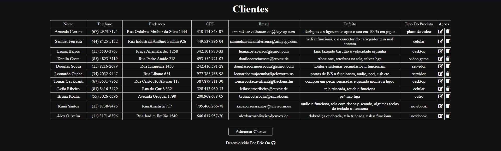

# Projeto Assistencia Tecnica PHP

Este É Um Projeto De Uma Assistência Técnica Fictícia Que Conta Com Um Formulário Para Registro De Solicitações E Uma Tabela De Administração Para Gerenciamento Das Mesmas. Para O Desenvolvimento Do Projeto, Foi Aplicado o Conceito CRUD Utilizando PHP E MYSQL.

 

Na Imagem Acima, Temos um Formulário Para Registro De Solicitações, Onde O Pode Ser Inserido Os Dados Pessoais E A Descrição Da Solicitação.

 

Na Imagem Acima Temos A Tabela De Administração Onde O Administrador Pode Ver Todas As Solicitações Feitas Pelos Clientes, Também Pode Editar E Excluir As Solicitações.

 
